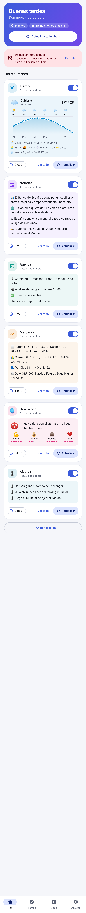
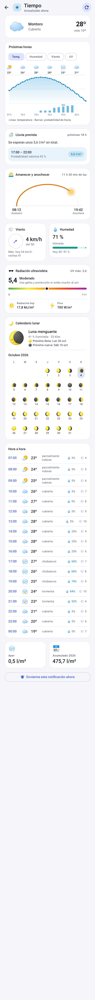
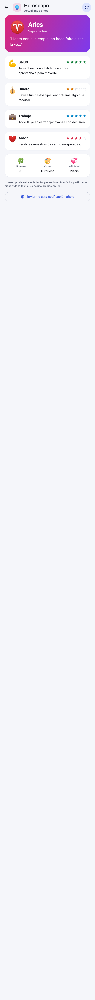
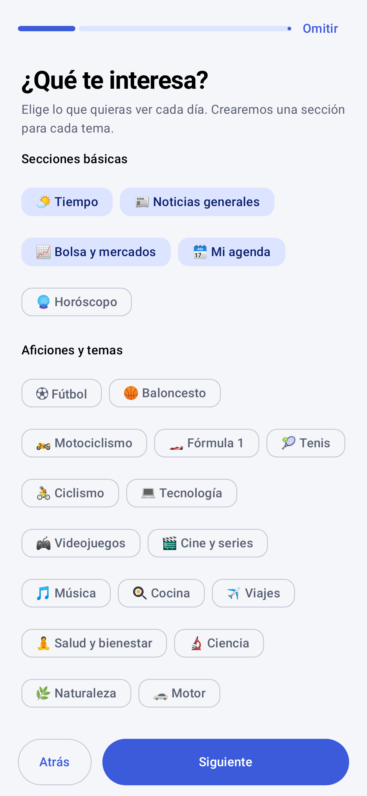

# Agenda Personal

Tu información de cada día y tus avisos, en **un bot de Telegram** que funciona en cualquier móvil (Android, iPhone…).
Todo corre en la nube con **Firebase**; no hay que instalar nada más que Telegram.

* **Asistente inicial**: te pregunta qué te interesa, tu fecha de nacimiento, tu ciudad… (todo opcional, con «Omitir»).
* **Resúmenes programados** a la hora que elijas: tiempo (con lluvia prevista, sol, viento, UV y luna), noticias de tu zona,
  agenda, horóscopo, mercados y los temas que quieras seguir.
* **Menús con botones** para crear, ver, **modificar y eliminar alarmas, citas y tareas** (con repetición, antelación y
  «posponer»), y para cambiar secciones, horas y datos.

👉 **Dos formas de desplegarlo (misma lógica):**
* **Cloudflare Workers + D1 — gratis, sin tarjeta:** [`cloudflare/README.md`](cloudflare/README.md).
* **Firebase (plan Blaze, requiere tarjeta):** [`firebase/README.md`](firebase/README.md) (arquitectura, tests y límites).

> La app Android que hay más abajo fue la primera versión del proyecto. Se conserva en el repositorio (carpeta `app/`) como
> cliente alternativo, pero el sistema principal es el bot.

---

# App Android (primera versión, opcional)

App Android (Kotlin + Jetpack Compose) que te envía **notificaciones diarias a la hora que elijas** con la
información que necesitas, y gestiona **tareas pendientes** y **citas médicas** con su propio aviso.

## Secciones incluidas

| Sección | Hora por defecto | Contenido |
|---|---|---|
| **Tiempo** | 07:00 | Gráfica por horas (temperatura, humedad, viento o UV) con iconos del tiempo; **lluvia prevista** (cuándo y cuántos l/m²); **amanecer y anochecer** con el arco del sol y las horas de luz; viento con dirección y rachas; humedad; **índice UV y radiación solar**; **calendario lunar** (fase de hoy, próximas lunas llena y nueva, y el mes completo); lista hora a hora; lluvia de ayer y acumulada del año. Datos de [Open-Meteo](https://open-meteo.com) (sin clave); la luna se calcula en el móvil (algoritmo de Meeus). |
| **Noticias** | 07:10 | Economía, política, fútbol y motociclismo (Google News RSS) + provincia, ayuntamientos a seguir (por defecto Montoro y Córdoba, editables) y nombres a vigilar (alcalde, concejales…) + feeds RSS propios. |
| **Agenda** | 07:20 | Citas de hoy y mañana y tareas pendientes (sin Internet). |
| **Mercados** | 14:00 | Futuros/premercado de Wall Street, noticias económicas, cierre de la última sesión (EEUU, Europa, Asia) y crónica de mercados. Fuente: Yahoo Finance (API no oficial). |
| **Horóscopo** | 08:00 | Horóscopo **real** del día de tu signo, en español, con enlace a la fuente. Lo descarga cada día una Cloud Function de Firebase desde [horoscopefree](https://github.com/vitorebatista/horoscopefree) (texto de 20minutos.es) y la app lo lee de Firestore, con caché offline. Hay que desplegar `firebase/` y añadir `google-services.json`: ver [`firebase/README.md`](firebase/README.md). Sin eso la sección indica que no está disponible (no inventa nada). |
| **Secciones propias** | 08:30+ | Las que crees tú (ajedrez, cine, tu equipo…): noticias sobre el tema que elijas, con su propia hora y notificación. |

## Primera vez: configuración inicial

Al abrir la app por primera vez aparece un asistente (todo opcional, con **Omitir** en cada paso):
intereses y aficiones (secciones básicas, 23 temas y los que escribas), nombre y fecha de nacimiento, municipio,
y una tarea o cita para empezar. Si se omite, se entra directamente en la pantalla principal con la configuración por
defecto. Todo se puede cambiar después en **Ajustes** (Perfil, Mis secciones, «Repetir la configuración inicial»).

## Cómo se usa

- **Pantalla «Hoy»**: cada sección muestra sus **últimos datos guardados** al abrir la app. «Actualizar» (por sección) o
  «Actualizar todo ahora» refrescan el contenido en la propia tarjeta; «Ver todo» abre la sección completa.
  Cada una se activa/desactiva y cambia de hora; «Añadir sección» crea una nueva (la ubicación, provincia y ayuntamientos se cambian en Ajustes si te mudas).
- **Notificaciones de resumen**: diseño propio con barra e icono de color por sección, titulares destacados y vista
  compacta/expandida. Al tocarlas se abre **solo esa sección**.
- **Recordatorios de tareas y citas**: la notificación trae tres botones: **Eliminar**, **Conservar** y **Modificar**
  (este último abre la edición de ese evento). También puedes tocar cualquier tarea o cita en la app para modificarla.

## Capturas

> Las capturas se generan en tests con datos de ejemplo (por ejemplo, el texto del horóscopo es de prueba, no el del editor).

| Hoy | Tiempo (completo) | Horóscopo | Asistente inicial |
|---|---|---|---|
|  |  |  |  |

| Tareas | Citas | Ajustes |
|---|---|---|
|  |  |  |

Resumen de mercados: [claro](docs/screenshots/detail_markets_light.png) · [oscuro](docs/screenshots/detail_markets_dark.png).
Asistente: [pasos 2](docs/screenshots/onboarding_2_light.png) · [3](docs/screenshots/onboarding_3_light.png) · [4](docs/screenshots/onboarding_4_light.png) · [5](docs/screenshots/onboarding_5_light.png). Aspecto de las notificaciones: [claro](docs/screenshots/notifications_light.png) · [oscuro](docs/screenshots/notifications_dark.png).
Modo oscuro: [Hoy](docs/screenshots/home_dark.png) · [Tareas](docs/screenshots/tasks_dark.png) · [Citas](docs/screenshots/appointments_dark.png) · [Ajustes](docs/screenshots/settings_dark.png).

## Cómo añadir una sección nueva

1. Crea un `object MiSeccion : Section` en `app/src/main/java/com/agendapersonal/sections/` (mira `WeatherSection.kt`):
   `id`, `title`, `description`, hora por defecto y `suspend fun build(context): Digest`.
   `DigestBuilder` ayuda a combinar varias fuentes tolerando fallos parciales.
2. Regístrala en `SectionRegistry.all`.

Ya está: aparece en la app con su interruptor, hora, vista previa, alarma diaria y notificación.

## Cómo funciona

- `Scheduler` programa una alarma exacta (`AlarmManager`) por sección y por aviso; se reprograma al reiniciar el móvil
  o cambiar la hora/zona (`BootReceiver`).
- Al saltar la alarma, `AlarmReceiver` reprograma el día siguiente y lanza `DigestWorker` (WorkManager, con
  reintentos si no hay red), que genera el contenido y publica la notificación.
- Tareas y citas se guardan en Room (SQLite local).

## Compilar

Necesitas Android Studio (o JDK 17 + Android SDK 34).

```
./gradlew assembleDebug      # APK en app/build/outputs/apk/debug/app-debug.apk
```

El workflow `.github/workflows/build-apk.yml` compila el APK en cada push y lo deja como artefacto descargable.

## Notas y límites

- **Redes sociales**: X/Instagram/Facebook no permiten scraping fiable (login, anti-bots, términos de uso). La app
  vigila nombres a través de Google News y acepta feeds RSS propios; para perfiles concretos puedes usar una
  instancia de RSSHub o similar y pegar su URL en Ajustes.
- La lluvia procede de datos de modelo meteorológico para tus coordenadas, no de un pluviómetro concreto.
- Yahoo Finance no es una API oficial y puede cambiar o limitar peticiones.
- En algunos móviles (Xiaomi, Huawei, Samsung…) hay que quitar la optimización de batería a la app para que las alarmas
  no se retrasen. Y en Android 12+ hay que conceder «Alarmas y recordatorios» (la app te lo indica).
- Los resúmenes son listados de titulares y cifras; no hay resumen redactado por IA (sería una posible ampliación).

## Tests

Backend del horóscopo: `cd firebase/functions && npm install && npm test`.

```
./gradlew :app:testDebugUnitTest            # parser RSS con datos reales de ejemplo
LIVE=1 ./gradlew :app:testDebugUnitTest -i  # además, ejecuta cada sección contra Internet real e imprime el resultado
```
