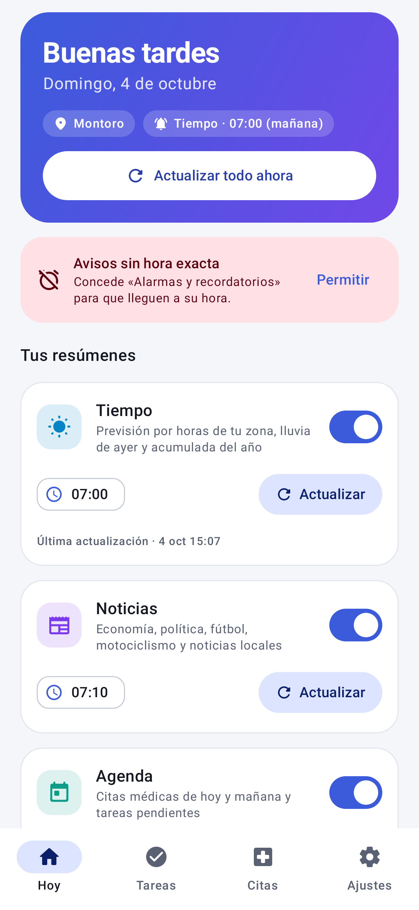
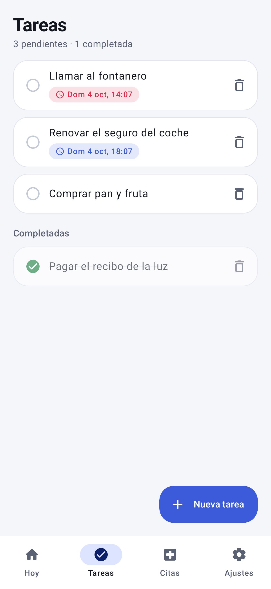
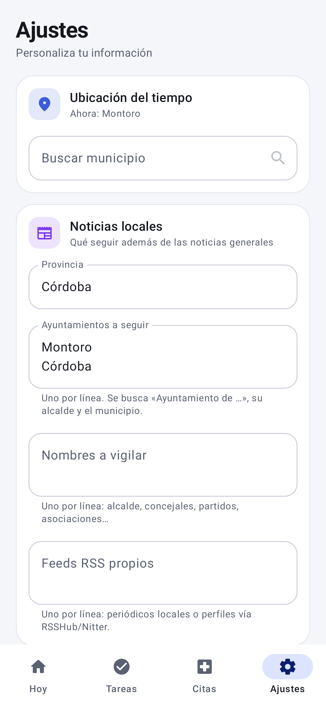

# Agenda Personal (Android)

App Android (Kotlin + Jetpack Compose) que te envía **notificaciones diarias a la hora que elijas** con la
información que necesitas, y gestiona **tareas pendientes** y **citas médicas** con su propio aviso.

## Secciones incluidas

| Sección | Hora por defecto | Contenido |
|---|---|---|
| **Tiempo** | 07:00 | Previsión hora a hora de tu zona, lluvia de ayer (l/m²) y acumulada del año. Fuente: [Open-Meteo](https://open-meteo.com) (sin clave). |
| **Noticias** | 07:10 | Economía, política, fútbol y motociclismo (Google News RSS) + provincia, ayuntamientos a seguir (por defecto Montoro y Córdoba, editables) y nombres a vigilar (alcalde, concejales…) + feeds RSS propios. |
| **Agenda** | 07:20 | Citas de hoy y mañana y tareas pendientes (sin Internet). |
| **Mercados** | 14:00 | Futuros/premercado de Wall Street, noticias económicas, cierre de la última sesión (EEUU, Europa, Asia) y crónica de mercados. Fuente: Yahoo Finance (API no oficial). |

Cada sección se activa/desactiva y cambia de hora (la ubicación, provincia y ayuntamientos se cambian en Ajustes si te mudas) desde la pestaña **Resúmenes**; allí también puedes pulsar
*Ver ahora* o *Enviar notificación de prueba*. Las tareas y las citas tienen su aviso individual
(las citas con antelación configurable: 30 min, 1 h, 3 h, 1 día).

## Capturas

| Hoy | Tareas | Citas | Ajustes |
|---|---|---|---|
|  |  |  |  |

Resumen de mercados: [claro](docs/screenshots/detail_markets_light.png) · [oscuro](docs/screenshots/detail_markets_dark.png).
Modo oscuro: [Hoy](docs/screenshots/home_dark.png) · [Tareas](docs/screenshots/tasks_dark.png) · [Citas](docs/screenshots/appointments_dark.png) · [Ajustes](docs/screenshots/settings_dark.png).

## Cómo añadir una sección nueva

1. Crea un `object MiSeccion : Section` en `app/src/main/java/com/agendapersonal/sections/` (mira `WeatherSection.kt`):
   `id`, `title`, `description`, hora por defecto y `suspend fun build(context): Digest`.
   `DigestBuilder` ayuda a combinar varias fuentes tolerando fallos parciales.
2. Regístrala en `SectionRegistry.all`.

Ya está: aparece en la app con su interruptor, hora, vista previa, alarma diaria y notificación.

## Cómo funciona

- `Scheduler` programa una alarma exacta (`AlarmManager`) por sección y por aviso; se reprograma al reiniciar el móvil
  o cambiar la hora/zona (`BootReceiver`).
- Al saltar la alarma, `AlarmReceiver` reprograma el día siguiente y lanza `DigestWorker` (WorkManager, con
  reintentos si no hay red), que genera el contenido y publica la notificación.
- Tareas y citas se guardan en Room (SQLite local).

## Compilar

Necesitas Android Studio (o JDK 17 + Android SDK 34).

```
./gradlew assembleDebug      # APK en app/build/outputs/apk/debug/app-debug.apk
```

El workflow `.github/workflows/build-apk.yml` compila el APK en cada push y lo deja como artefacto descargable.

## Notas y límites

- **Redes sociales**: X/Instagram/Facebook no permiten scraping fiable (login, anti-bots, términos de uso). La app
  vigila nombres a través de Google News y acepta feeds RSS propios; para perfiles concretos puedes usar una
  instancia de RSSHub o similar y pegar su URL en Ajustes.
- La lluvia procede de datos de modelo meteorológico para tus coordenadas, no de un pluviómetro concreto.
- Yahoo Finance no es una API oficial y puede cambiar o limitar peticiones.
- En algunos móviles (Xiaomi, Huawei, Samsung…) hay que quitar la optimización de batería a la app para que las alarmas
  no se retrasen. Y en Android 12+ hay que conceder «Alarmas y recordatorios» (la app te lo indica).
- Los resúmenes son listados de titulares y cifras; no hay resumen redactado por IA (sería una posible ampliación).

## Tests

```
./gradlew :app:testDebugUnitTest            # parser RSS con datos reales de ejemplo
LIVE=1 ./gradlew :app:testDebugUnitTest -i  # además, ejecuta cada sección contra Internet real e imprime el resultado
```
